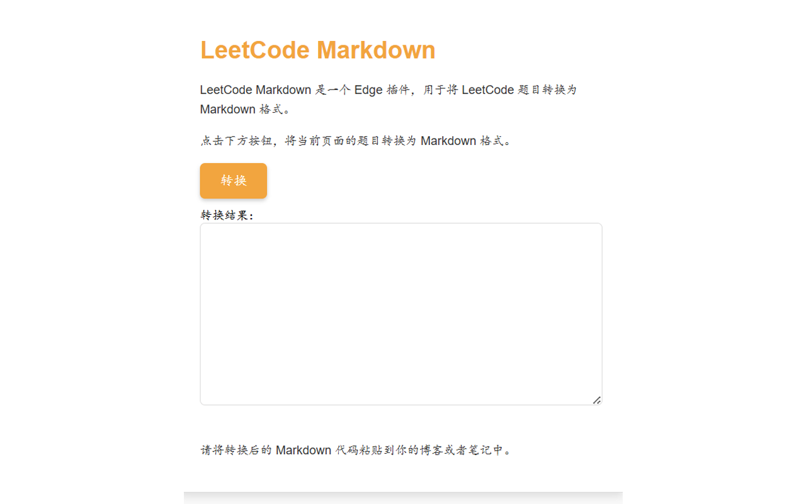
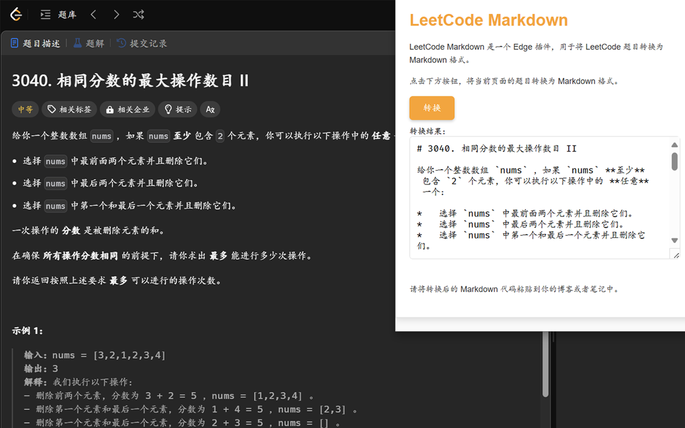

# LeetCode Markdown

 

## 功能

LeetCode Markdown 是一款浏览器插件，帮助用户将[力扣](https://leetcode.cn/)网站上的题目转化为 markdown 格式保存下来。

## 安装

**现已上架 Edge 浏览器商店。**
[点击此](https://microsoftedge.microsoft.com/addons/detail/leetcodemarkdown/ocbihjjehhpociepapklcnbdbncficck)或者搜索 `LeetCode-Markdown` 安装。

### 本地安装

将本项目下载到本地，解压后在浏览器扩展页面选择`加载解压缩的扩展`。

## 目标

- [x] 优化一些符号、行内代码块、强调、引用的 markdown 格式转换
- [ ] 优化 popup 界面的显示
- [x] 优化转化后的题目没有标题的问题
- [x] 更新 icon
- [x] 修复数学公式的转换

## 参考文档

- [Microsoft Edge 扩展](https://learn.microsoft.com/zh-cn/microsoft-edge/extensions-chromium/)
- [turndown](https://github.com/mixmark-io/turndown)
